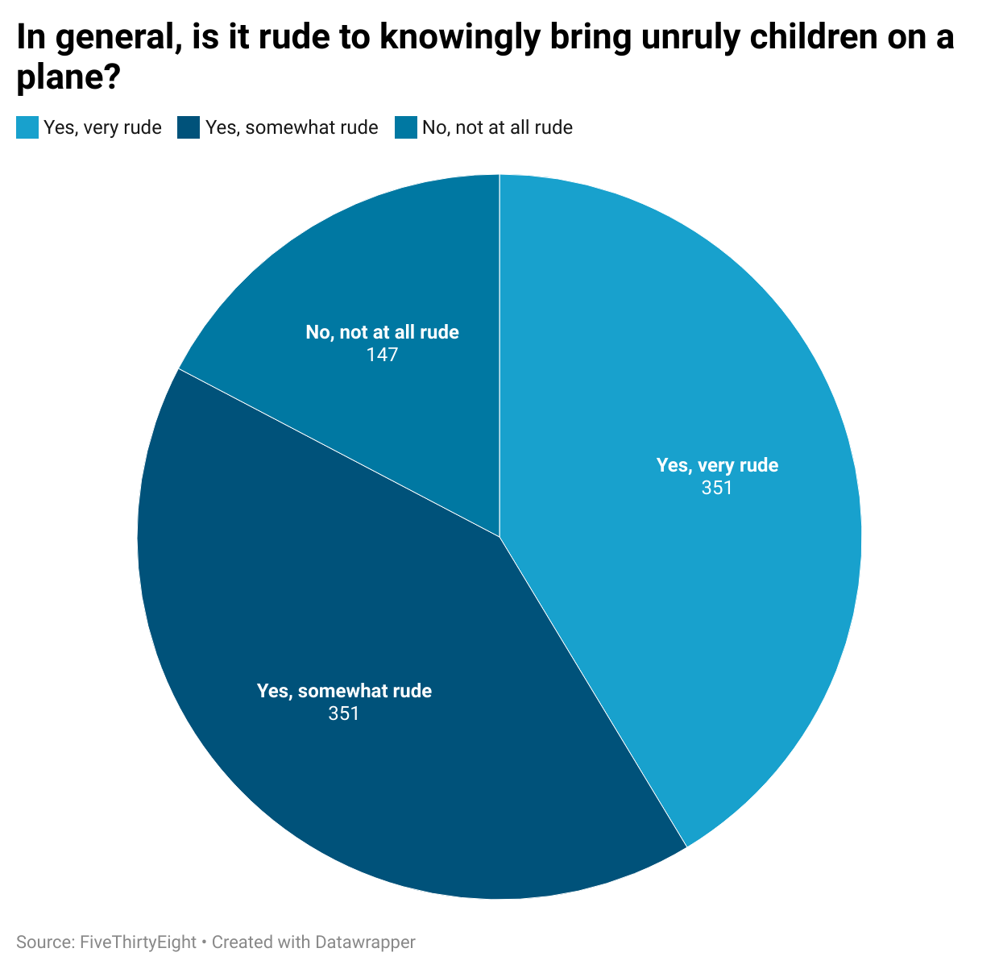

# journ124hw

## Why I Chose This Question

I picked this question because it my personal relatable travel experience. It’s interesting to see how opinions vary on what’s considered acceptable behavior in shared public spaces such as the aircraft.

## Chart Explanation

The pie chart shows public opinion on whether it's rude to knowingly bring unruly children on a plane. The results reveal a strong consensus that most people do find it rude at least somewhat rude.

